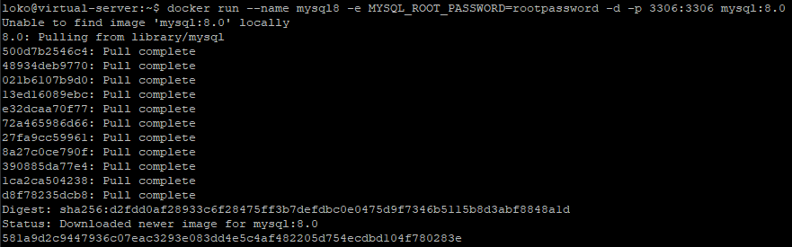
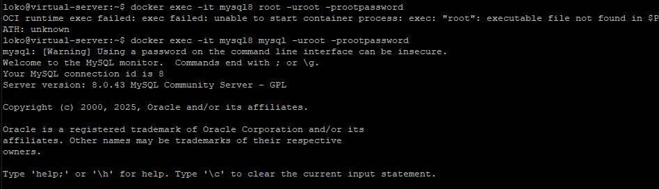
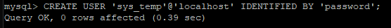
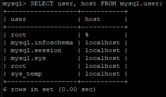
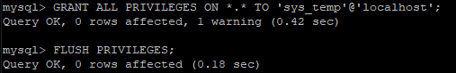
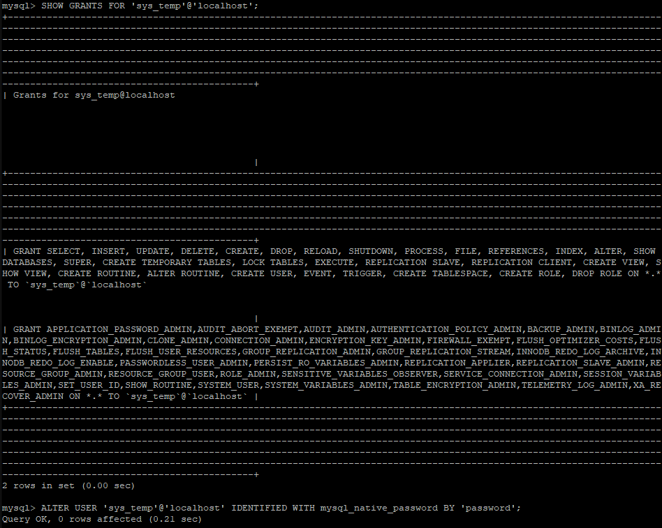
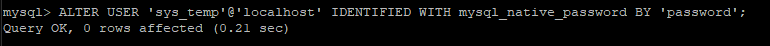
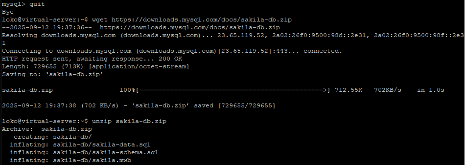
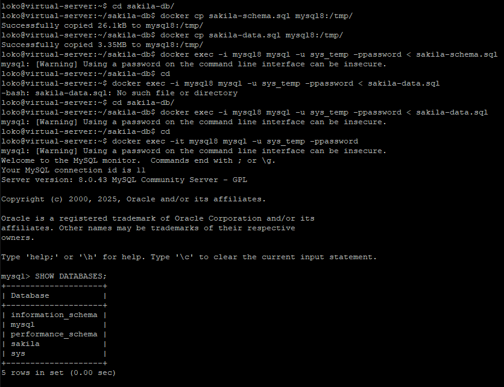
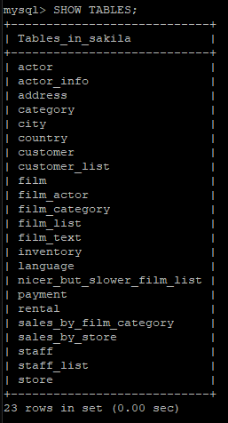

# [Домашнее задание](https://github.com/netology-code/sdb-homeworks/blob/main/12-02.md) к занятию "`Работа с данными (DDL/DML)`" - `Янин Семён`


### Инструкция по выполнению домашнего задания

   1. Сделайте `fork` данного репозитория к себе в Github и переименуйте его по названию или номеру занятия, например, https://github.com/имя-вашего-репозитория/git-hw или  https://github.com/имя-вашего-репозитория/7-1-ansible-hw).
   2. Выполните клонирование данного репозитория к себе на ПК с помощью команды `git clone`.
   3. Выполните домашнее задание и заполните у себя локально этот файл README.md:
      - впишите вверху название занятия и вашу фамилию и имя
      - в каждом задании добавьте решение в требуемом виде (текст/код/скриншоты/ссылка)
      - для корректного добавления скриншотов воспользуйтесь [инструкцией "Как вставить скриншот в шаблон с решением](https://github.com/netology-code/sys-pattern-homework/blob/main/screen-instruction.md)
      - при оформлении используйте возможности языка разметки md (коротко об этом можно посмотреть в [инструкции  по MarkDown](https://github.com/netology-code/sys-pattern-homework/blob/main/md-instruction.md))
   4. После завершения работы над домашним заданием сделайте коммит (`git commit -m "comment"`) и отправьте его на Github (`git push origin`);
   5. Для проверки домашнего задания преподавателем в личном кабинете прикрепите и отправьте ссылку на решение в виде md-файла в вашем Github.
   6. Любые вопросы по выполнению заданий спрашивайте в чате учебной группы и/или в разделе “Вопросы по заданию” в личном кабинете.
   
Желаем успехов в выполнении домашнего задания!
   
### Дополнительные материалы, которые могут быть полезны для выполнения задания

1. [Руководство по оформлению Markdown файлов](https://gist.github.com/Jekins/2bf2d0638163f1294637#Code)

---

### Задание 1

1.1





1.2



1.3



1.4



1.5



1.6



1.7



1.8



`Результат выполнения`



```
$docker run --name mysql8 -e MYSQL_ROOT_PASSWORD=rootpassword -d -p 3306:3306 mysql:8.0
$docker exec -it mysql8 mysql -uroot -prootpassword
>CREATE USER 'sys_temp'@'localhost' IDENTIFIED BY 'password';
>SELECT user, host FROM mysql.user;
>GRANT ALL PRIVILEGES ON *.* TO 'sys_temp'@'localhost';
>FLUSH PRIVILEGES;
>SHOW GRANTS FOR 'sys_temp'@'localhost';
>ALTER USER 'sys_temp'@'localhost' IDENTIFIED WITH mysql_native_password BY 'password';
>quit
$wget https://downloads.mysql.com/docs/sakila-db.zip
$unzip sakila-db.zip
$cd sakila-db
$docker cp sakila-schema.sql mysql8:/tmp/
$docker cp sakila-data.sql mysql8:/tmp/
$docker exec -i mysql8 mysql -u sys_temp -ppassword < sakila-schema.sql
$docker exec -i mysql8 mysql -u sys_temp -ppassword < sakila-data.sql
$cd
$docker exec -it mysql8 mysql -u sys_temp -ppassword
>SHOW DATABASES;
>USE sakila
>SHOW TABLES;
```

`При необходимости прикрепитe сюда скриншоты
`


---

### Задание 2

`Приведите ответ в свободной форме........`

1. `Заполните здесь этапы выполнения, если требуется ....`
2. `Заполните здесь этапы выполнения, если требуется ....`
3. `Заполните здесь этапы выполнения, если требуется ....`
4. `Заполните здесь этапы выполнения, если требуется ....`
5. `Заполните здесь этапы выполнения, если требуется ....`
6. 

```
Поле для вставки кода...
....
....
....
....
```

`При необходимости прикрепитe сюда скриншоты
`


---
